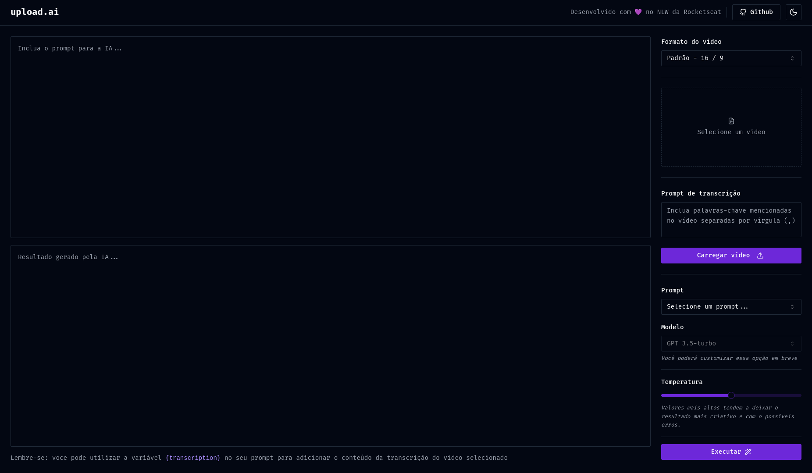

# Upload.AI

Upload.AI é um projeto construído durante o evento da NLW Rocketseat que combina a potência da inteligência artificial com a simplicidade da web para gerar títulos e descrições automaticamente a partir de vídeos.

## Funcionalidades

- **Geração de Títulos e Descrições:** Com Upload.AI, você pode carregar um vídeo e deixar a inteligência artificial (IA) criar automaticamente títulos e descrições relevantes para o seu conteúdo.

- **Integração com IA (charGPT):** O projeto utiliza a IA (charGPT) para analisar o conteúdo do vídeo e gerar texto de alta qualidade para aumentar a visibilidade e a acessibilidade do seu conteúdo.

- **Facilidade de Uso:** A interface web amigável torna o processo de geração de títulos e descrições simples e acessível para qualquer pessoa, mesmo sem conhecimento técnico.

- **Tecnologias Modernas:** Upload.AI utiliza uma variedade de tecnologias modernas, incluindo TypeScript, Fastify, Prisma, React, Tailwind CSS e muito mais, para fornecer uma experiência de usuário eficaz e eficiente.

## Tecnologias Utilizadas

### Backend

- **Fastify:** Um framework web rápido e eficiente para o servidor backend.

- **Prisma:** Uma ferramenta de acesso a banco de dados que simplifica a interação com bancos de dados SQL.

- **charGPT (IA):** A inteligência artificial charGPT, fornecida pela OpenAI, é usada para análise e geração de texto.

### Frontend

- **React:** Uma biblioteca JavaScript para criação de interfaces de usuário eficazes.

- **Tailwind CSS:** Um framework CSS utilitário para design responsivo e eficiente.

- **axios:** Uma biblioteca para realizar requisições HTTP de forma fácil e eficiente.

## Como Usar

1. Clone o repositório.
2. Instale as dependências do backend e do frontend usando `pnpm install` em seus respectivos diretórios.
3. Configure as variáveis de ambiente necessárias para o projeto, incluindo chaves de acesso à IA e configurações de banco de dados.
> Irei deixar um arquivo de exemplo das variáveis de ambiente [aqui.](./api/.env-example) 
4. Execute o servidor backend e o aplicativo frontend em ambientes de desenvolvimento usando o comando `pnpm run start:dev`.

## Licença

Este projeto está licenciado sob a [Licença MIT](https://github.com/joaovic-tech/upload-ai-nlw/blob/main/LICENSE).

